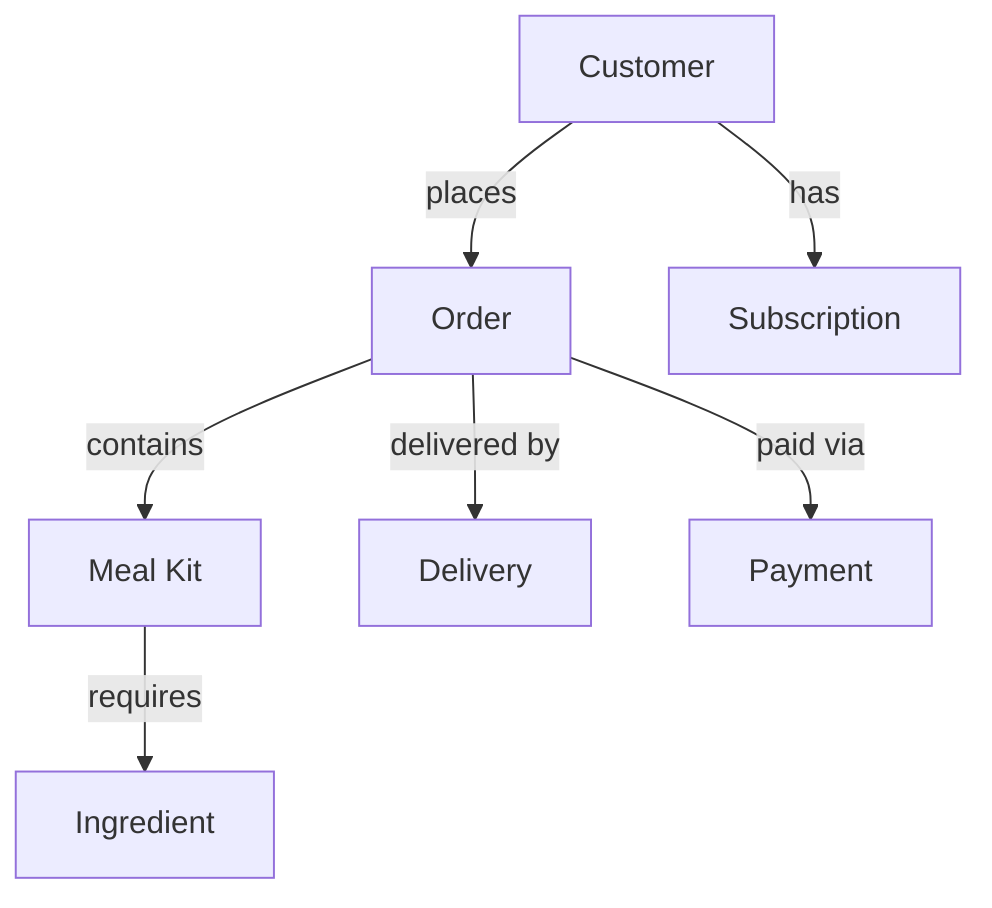

# CloudGourmet
Database Design & ERD (PostgreSQL)

This repository contains the deliverables for **CloudGourmet**, focusing on database design, entity-relationship modeling, and schema planning using PostgreSQL and pgAdmin.

The system is based on a **meal-kit subscription platform**, designed to handle customers, orders, recipes, ingredients, and delivery logistics.

---

## 📦 Files Included

| File | Description |
|------|-------------|
| **Assignment#1.docx** | Written assignment with explanations and submission details |
| **Assignment#1.png** | ERD diagram exported as an image |
| **Assignment #1.pgerd** | Editable ERD file created using pgAdmin/pgERD |

---

## 🧠 Assignment Overview

The purpose of this assignment is to design a **normalized relational database structure** for the CloudGourmet system.  
The design focuses on:

- Identifying system **entities**
- Defining **primary keys** & **foreign keys**
- Modeling **relationships** (1-to-many, many-to-many)
- Ensuring **data integrity** and proper normalization

---

## 🗄️ Main Entities in the System

- **Customer**
- **Subscription**
- **Meal Kit / Recipe**
- **Ingredients**
- **Order**
- **Delivery**
- **Payment**

These entities work together to support the main business functions of CloudGourmet.

---

## 🖼️ ERD Diagram (Preview)

The ERD diagram is included as `Assignment#1.png`.

---

## 🛠 Tools Used

- **PostgreSQL** – Database engine used for modeling and schema design  
- **pgAdmin / pgERD** – Tools for ERD creation and PostgreSQL management  
- **Microsoft Word** – Documentation and assignment write-up  
- **Diagramming tools** – Used to export ERD diagram as PNG  

---

## 📚 Learning Objectives

✔ Learn and apply **relational database modeling** concepts  
✔ Create, analyze, and revise **Entity-Relationship Diagrams (ERD)**  
✔ Understand and apply **database normalization** to avoid redundancy  
✔ Define **Primary Keys (PK)** and **Foreign Keys (FK)** with proper relationships  
✔ Perform **system requirement analysis** to map business needs into database structure  

---

